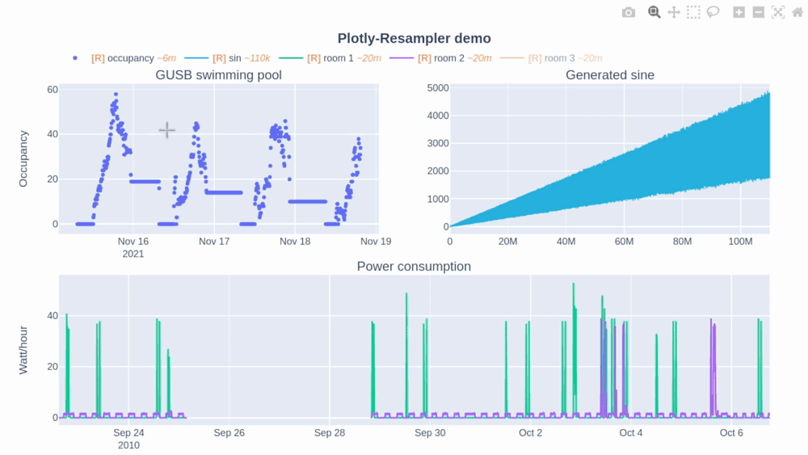

# Welcome to plotly-resampler's documentation!

This is the documentation of ;
a wrapper for plotly Figures to **visualize large time-series** data.

As shown in the demo above, `plotly-resampler` maintains its interactiveness on large data by applying front-end
**resampling respective to the view**.

[:fontawesome-solid-download: PyPI](https://pypi.org/project/plotly-resampler/){ .md-button .md-button--primary }
[:simple-github: Github](https://github.com/predict-idlab/plotly-resampler){ .md-button .md-button--primary }
[:simple-doi: DOI](https://doi.org/10.48550/arXiv.2206.08703){ .md-button .md-button--primary }
